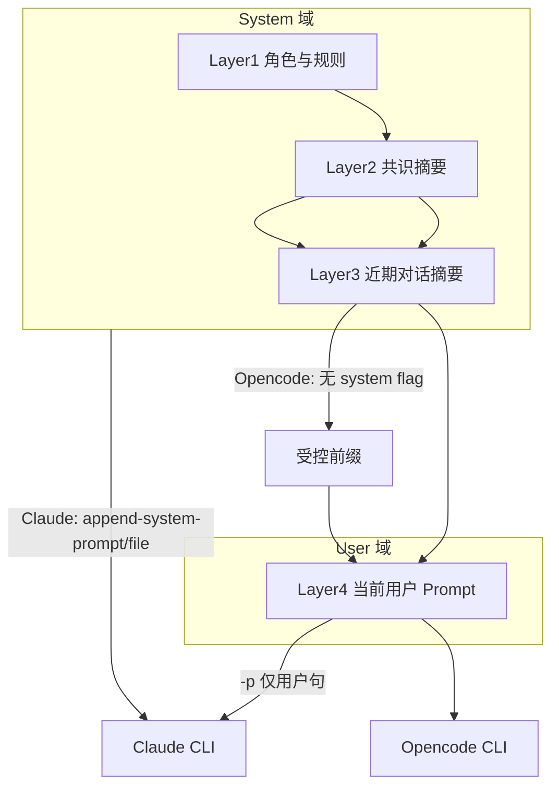
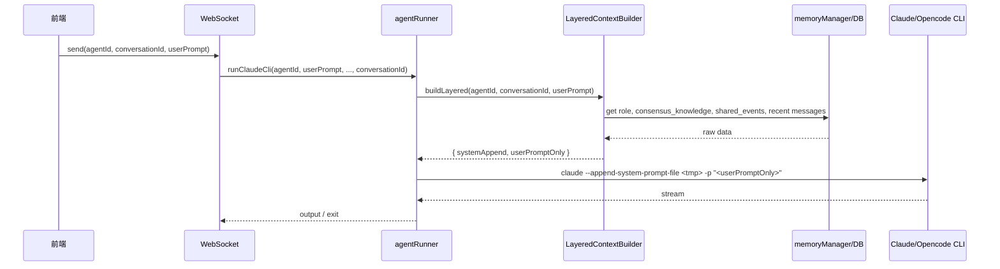

# 共识信息分层 Prompt 与 System Prompt 设计

设计分层共识上下文机制，将「角色/共识/近期对话」与「用户当前 prompt」分离，避免长期记忆膨胀；并利用 Claude CLI 的 `--append-system-prompt` 将非用户内容放入 system，用户 prompt 保持纯净。

---

## 一、现状与问题

### 1.1 当前实现

- **上下文来源**：`memoryManager.buildAgentContext`（server/services/memoryManager.js）从 `global_messages` 取最近 10 条，配对为「用户问 X / Y 回答」，取最近 3 轮并截断（问 50 字、答 100 字），拼成字符串 `"最近对话 - 用户问A: ...; B回答: ..."`。
- **注入方式**：agentRunner.runClaudeCli / runOpencodeCli（server/services/agentRunner.js）将上述字符串与用户 prompt 拼成一条：`enrichedPrompt = \`${prompt} - 上下文: ${memoryContext}\``，整段作为 **用户 prompt** 传给 CLI（`-p` 参数）。
- **已有数据未用**：DB 中已有 shared_events（事件流）、consensus_knowledge（共识知识），但 `buildAgentContext` 未使用，共识信息未参与当前 prompt。

### 1.2 问题

- **长期膨胀**：若把更多历史或更完整对话拼进 prompt，token 会线性增长，成本与上下文窗口压力大。
- **角色与共识混入用户句**：角色说明、共识摘要、近期对话和「当前用户问题」混在同一段，既占用户位又不利于模型区分「背景」与「当前请求」。
- **Windows 安全**：doc/bugfix-windows-shell-special-chars.md 表明括号、引号等会导致 cmd 解析错误，复杂上下文直接拼进 `-p` 易出问题。

---

## 二、CLI 能力：System vs User 分离

### 2.1 Claude CLI（已支持）

官方 [CLI reference](https://docs.anthropic.com/en/docs/claude-code/cli-usage) 明确支持系统级提示：

| 参数 | 行为 | 模式 |
|------|------|------|
| `--append-system-prompt "..."` | 在默认 system prompt 末尾追加自定义内容 | Interactive + Print |
| `--append-system-prompt-file <path>` | 从文件追加内容到默认 system prompt | 仅 Print（`-p`） |
| `--system-prompt "..."` | 完全替换默认 system prompt | 两者均可 |
| `--system-prompt-file <path>` | 用文件内容替换默认 system prompt | 仅 Print |

**建议**：用 `--append-system-prompt` 或 `--append-system-prompt-file` 传递「共识 + 近期对话」等背景，保留 Claude Code 默认能力；**用户当前问题单独用 `-p`**，不混入上下文。  
若内容较长或含特殊字符，优先 **写入临时文件 + `--append-system-prompt-file`**，避免 Windows 下引号/括号问题。

### 2.2 Opencode CLI（配置为主）

- 系统级提示主要通过 **项目/用户配置**：`opencode.json` 的 mode.prompt、`.opencode/modes/*.md` 的 frontmatter 等，不是「单次 run 传一段 system 文本」的 flag。
- `opencode run` 有 `--prompt`，一般为**当次用户输入**，未查到等价于 `--append-system-prompt` 的单次运行参数。

**结论**：Opencode 暂不假定「本次调用的 system 追加」；共识与近期对话可继续以 **sanitized 的短摘要**作为 user prompt 前缀（或后续若提供类似 flag 再迁移）。

---

## 三、分层 Prompt 设计

### 3.1 分层定义

将注入内容分为四层，**只有 Layer 4 是真正的用户当前输入**，其余尽量放入 system（Claude）或受控前缀（Opencode）。

| 层级 | 内容 | 来源 | 长度/策略 | 注入位置（Claude） | 注入位置（Opencode） |
|------|------|------|-----------|--------------------|----------------------|
| **Layer 1** | Agent 角色、职责、本对话规则（如「你是架构师，与本对话中其他 Agent 协作」） | agents 表 role/responsibility、或固定模板 | 固定模板 + 变量，约 200–500 字 | system（append） | 若支持则 system；否则 user 首段 |
| **Layer 2** | 共识信息：已达成结论、关键决策、共享知识 | consensus_knowledge（按 conversation_id 或全局）+ shared_events 的 summary/高 importance | 按 key 或时间取最近 N 条，总字符上限（如 800–1500） | system（append） | user 前缀（sanitized） |
| **Layer 3** | 近期对话摘要 | 当前 buildAgentContext 逻辑的「精简版」：轮数更少（如 2 轮）、单条更短（如 30/60 字） | 总字符上限（如 400–800） | system（append） | user 前缀（sanitized） |
| **Layer 4** | 当前用户输入 | 前端传入的原始 prompt | 不截断 | **仅 `-p`**（Claude）/ 主 prompt（Opencode） | **仅主 prompt** |

### 3.2 长度与膨胀控制

- **每层设字符上限**（可配置）：Layer 2 例如 1200 字，Layer 3 例如 600 字，超出则截断或按时间/importance 丢弃最旧。
- **Layer 2 优先用 summary/value**：shared_events 用 `summary` 或短 `content`；consensus_knowledge 用 `value` + 必要 `context` 一行，避免整段 content 灌入。
- **Layer 3 与现有 buildAgentContext 的关系**：可保留「最近对话」逻辑但收紧为「2 轮 + 更短截断」，或改为「仅最后 1 轮完整 + 再前 1 轮摘要」，总 token/字符受控。

---

## 四、实现要点（无代码修改，仅设计）

### 4.1 新模块：LayeredContextBuilder（建议路径）

- **输入**：agentId, conversationId, currentUserPrompt（原始）。
- **输出**：
  - `systemAppend: string` — Layer 1 + Layer 2 + Layer 3 拼接后的**单段文本**（用于 Claude `--append-system-prompt` 或写入临时文件）；
  - `userPromptOnly: string` — 即 currentUserPrompt（Layer 4），不做拼接。
- **内部**：
  - Layer 1：从 agents 表取 role/responsibility，填模板。
  - Layer 2：查 consensus_knowledge（按 conversation 或全局）、shared_events（按 conversation_id，按 importance/时间取），格式化为「共识摘要」段落，总长上限。
  - Layer 3：查 global_messages（同当前 buildAgentContext），但轮数/单条长度更严，总长上限。
  - 对 systemAppend 做**安全化**：若走 Windows 命令行传参，可对引号/括号做替换或转义；若走 `--append-system-prompt-file`，写入临时文件则无需对内容做 shell 转义。

### 4.2 agentRunner 与 minimal-claude 的调用方式

- **Claude**：
  - 调用 LayeredContextBuilder 得到 `systemAppend` 与 `userPromptOnly`。
  - 若 systemAppend 较短且已安全化，可 `--append-system-prompt "<content>"`；否则写入临时文件 `--append-system-prompt-file <path>`。
  - `-p` **仅传** `userPromptOnly`，不再把「上下文」拼进 `-p`。
- **Opencode**：
  - 暂无 system 追加时：仍将 Layer 2 + Layer 3 的**短摘要**（经 sanitize）作为 user prompt 前缀，Layer 4 为主句；或仅传 Layer 4，由后续 Opencode 能力再扩展。

### 4.3 memoryManager 与 buildAgentContext 的演进

- **短期**：保留 `buildAgentContext` 用于兼容或 Opencode 前缀；LayeredContextBuilder 内部可复用其「近期对话」查询逻辑但施加更严长度限制。
- **中期**：让 `buildAgentContext` 改为调用 LayeredContextBuilder 的「Layer 2 + Layer 3」部分，或废弃 buildAgentContext，统一由 LayeredContextBuilder 产出「system 追加」与「user 仅当前」。

### 4.4 临时文件与安全

- 使用 `--append-system-prompt-file` 时：在系统临时目录创建文件，写入 systemAppend，将文件路径传给 Claude CLI，进程退出后删除（或按会话/对话 ID 复用同一临时文件当次请求）。
- 内容编码建议 UTF-8，避免 BOM；内容中避免写入不可信用户输入（Layer 2/3 来自 DB 与系统生成，风险可控）。

---

## 五、数据流小结

---

## 六、交付物与后续可选

- **设计文档**：本方案即 doc/design-共识分层-prompt.md，包含分层表、数据流、与 Windows 安全注意点。
- **实现顺序建议**：
  1. 实现 LayeredContextBuilder（Layer 1 模板 + Layer 2 从 consensus_knowledge/shared_events 取数 + Layer 3 收紧版近期对话）；
  2. agentRunner + minimal-claude 改为接收 systemAppend，采用 `--append-system-prompt-file` 且 `-p` 仅 userPromptOnly；
  3. 观测 token/质量后，再调各层上限与是否启用 Layer 2 的 shared_events 明细；
  4. Opencode 若后续提供「单次 run 追加 system」再对齐为同一套 LayeredContextBuilder 输出。
