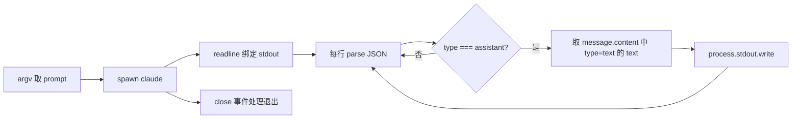

# minimal-claude.js 实现计划

## 目标

- 新建 minimal-claude.js（项目根目录）
- 使用**仅 Node.js 内置模块**：`child_process`、`readline`
- 运行方式：`node minimal-claude.js "你好，请用一句话介绍自己"`

## 脚本结构




## 实现要点

### 1. 入口与参数

- 从 `process.argv[2]` 读取用户问题；若无则可用默认提示（如 `"Hello"`）或直接退出并打印用法。
- 建议：无参数时 `console.error('Usage: node minimal-claude.js "your question"')` 并 `process.exit(1)`。

### 2. spawn 调用

- 命令：`claude`（依赖系统 PATH 中已安装 Claude CLI）。
- 参数数组：`['-p', prompt, '--output-format', 'stream-json', '--verbose']`。
- 选项：`{ stdio: ['inherit', 'pipe', 'inherit'] }`，这样 stdin 继承、stdout 用 pipe 供 readline 读、stderr 继承便于看错误。

### 3. readline 逐行解析

- `const rl = require('readline').createInterface({ input: child.stdout, crlfDelay: Infinity })`，`crlfDelay: Infinity` 避免把 `\r\n` 当两行。
- 监听 `rl.on('line', (line) => { ... })`，对非空行 `JSON.parse(line)`，若解析抛错则跳过（或只 catch 忽略该行）。

### 4. 提取 assistant 文本

- 解析得到的对象若 `obj.type === 'assistant'` 且存在 `obj.message?.content`（数组），则遍历该数组。
- 对其中 `item.type === 'text'` 的项，取 `item.text`，用 `process.stdout.write(item.text)` 或 `console.log` 输出（流式体验用 `write` 不换行）。
- 若希望最后换行，可在进程 `close` 时补一个 `console.log()`。

### 5. 进程退出

- `child.on('close', (code, signal) => { ... })`：可打印 `Exited with code ${code}` 或仅在 code !== 0 时打印；若需把退出码传给 shell，可 `process.exit(code)`。

### 6. 错误处理（保持简单）

- spawn 失败（如找不到 `claude`）：`child.on('error', (err) => { console.error(err); process.exit(1) })`。
- 单行 JSON 解析失败：catch 后跳过该行，不中断脚本。

## 关键代码片段（供实现时参考）

```javascript
const { spawn } = require('child_process');
const readline = require('readline');

const prompt = process.argv[2];
if (!prompt) {
  console.error('Usage: node minimal-claude.js "your question"');
  process.exit(1);
}

const child = spawn('claude', [
  '-p', prompt,
  '--output-format', 'stream-json',
  '--verbose'
], { stdio: ['inherit', 'pipe', 'inherit'] });

const rl = readline.createInterface({ input: child.stdout, crlfDelay: Infinity });

rl.on('line', (line) => {
  if (!line.trim()) return;
  try {
    const obj = JSON.parse(line);
    if (obj.type === 'assistant' && obj.message?.content) {
      for (const block of obj.message.content) {
        if (block.type === 'text' && block.text) {
          process.stdout.write(block.text);
        }
      }
    }
  } catch (_) {}
});

child.on('close', (code) => {
  rl.close();
  if (code !== 0) console.error(`Exited with code ${code}`);
  process.exit(code ?? 0);
});

child.on('error', (err) => {
  console.error(err);
  process.exit(1);
});
```

## 文件与运行

- **新建文件**：项目根目录下的 `minimal-claude.js`（与上述逻辑一致，可加简短注释）。
- **运行前**：确认本机已安装 [Claude CLI](https://docs.anthropic.com/en/docs/build-with-claude/claude-cli) 且 `claude` 在 PATH 中。
- **运行**：`node minimal-claude.js "你好，请用一句话介绍自己"`

## 说明（给用户的解释要点）

- **spawn 与 stdio**：`pipe` stdout 才能用 readline 读；stdin 用 `inherit` 避免 CLI 等待输入。
- **readline**：按行消费 spawn 的 stdout，便于处理 NDJSON（每行一个 JSON）。
- **stream-json + verbose**：按 Claude CLI 文档要求同时使用，才能得到示例中的 NDJSON 流。
- **assistant 结构**：`message.content` 为数组，元素可为 `{ type: 'text', text: '...' }`，需只取 `type === 'text'` 的 `text` 并输出。
