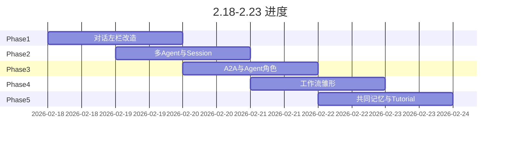
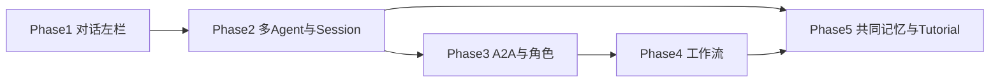

# plan-next 详细阶段计划（目标：2.23 前完成 80%）

基于 [plan-next.md](plan-next.md) 的下一步规划，将「任务列→对话列、多 Agent 互聊、A2A、角色、工作流、共同记忆」拆成 5 个 Phase，并在 2.23 前完成约 80% 核心工作（Phase 1–4 为主，Phase 5 为收尾与文档）。

---

## 当前代码现状摘要

- **左栏**：TaskPanel.jsx + useTasks.js + server/routes/tasks.js，`tasks` 表（title, description, status），无「最后聊天时间」、无分组。
- **消息**：global_messages 表含 `task_id`，但 GET /api/messages 未按 task_id 过滤，App.jsx 的 onExit 保存 assistant 消息时未带 `task_id`，因此「按任务/对话隔离」未贯通。
- **Agent**：单次发送通过 @ 指定一个 agent，agentRunner 每次 send 起新进程（Claude/Opencode），无 session resume；agents 表无 role/职责字段。
- **无 A2A、无工作流、无多 CLI 共同记忆抽象。**

---

## Phase 1：对话左栏改造（目标 2.19 晚）

**目标**：左侧由「任务列表」改为「对话列表」，支持新建对话、分组（可选）、展示最后聊天时间（如「3 天前」）。

| 步骤 | 内容 | 涉及文件/改动 |
|------|------|----------------|
| 1.1 数据层 | 将「任务」抽象为「对话」：若保留 tasks 表则增加 `last_activity_at`、可选 `group_name`；或新增 `conversations` 表（id, title, group_name, last_activity_at, created_at），并迁移/兼容现有 task_id。 | server/db.js：新表或 ALTER；server/routes/tasks.js 或新 conversations.js |
| 1.2 API | 对话 CRUD；GET 列表按 last_activity_at 降序；POST/PATCH 消息时更新对应对话的 last_activity_at。 | 新路由或扩展 tasks.js；server/routes/chats.js 在 POST message 时更新 conversation 时间 |
| 1.3 消息按对话隔离 | GET /api/messages 支持 `?conversation_id=`（或保留 task_id 语义）；仅返回该对话下消息。前端发消息、保存 assistant 消息时均带 conversation_id。 | server/routes/chats.js；client/hooks/useGlobalMessages.js 接受 conversationId 参数；client/App.jsx onExit 时传 conversationId |
| 1.4 左栏 UI | 列表项展示「标题 + 最后活动时间（X 分钟/小时/天前）」；支持新建对话；可选：分组折叠/展示 group_name。 | client/components/TaskPanel.jsx 重命名或拆为 ConversationPanel；App.jsx 将 selectedTaskId 改为 selectedConversationId 并传递 |

**交付**：左侧为对话列表，每个对话有最后活动时间，中间聊天内容按所选对话隔离。

---

## Phase 2：对话内多 Agent 与 Session Resume（目标 2.20 晚）

**目标**：同一对话中多人（多 agent）可轮流发言；进入对话时若 CLI 支持 session，则 resume 而非每次重新起进程。

| 步骤 | 内容 | 涉及文件/改动 |
|------|------|----------------|
| 2.1 多 Agent 消息流 | 保持现有 @agent 发一条、回一条；扩展为：同一 conversation 下可连续对多个 agent 发消息，消息列表按时间展示所有 agent 的 user/assistant，每条带 agent_id/agent_name。 | 已部分满足（global_messages 有 agent_id/agent_name）；确保 ChatPanel 按 conversation 拉消息并展示 |
| 2.2 Session 抽象 | 定义「会话」：conversation_id + agent_id + 可选 backend_session_id（如 Claude session_id）。agentRunner 或新模块维护「当前会话」：同一 conversation+agent 的多次 send 可复用同一进程或 resume。 | server/services/agentRunner.js 或新 sessionManager.js；minimal-claude.js / minimal-opencode.js 若 CLI 支持 resume（如 --resume）则传参 |
| 2.3 Resume 实现 | 调研各 CLI：Claude CLI 是否有 session resume 参数；Opencode 是否支持。在 runClaudeCli/runOpencodeCli 中增加「续写」入口（传入历史消息或 session_id），能 resume 则走 resume，否则新起进程并注入历史上下文（若 CLI 支持）。 | minimal-claude.js、minimal-opencode.js；WebSocket send 时带 conversation_id，后端决定 resume 或新开 |
| 2.4 前端状态 | 当前对话 + 当前选中的 agent 状态一致；发送时带 conversation_id，后端可据此查找已有 session。 | client/App.jsx、client/hooks/useWs.js 发送 payload 增加 conversation_id |

**交付**：同一对话内多 agent 消息按时间线展示；至少一种 CLI（如 Claude）支持 session resume 或「带上下文新开」并在产品上可用。

---

## Phase 3：A2A 与 Agent 角色（目标 2.21 晚）

**目标**：Agent 可主动向另一 Agent 发起对话（A2A）；每个 Agent 具备 role/名称/职责（如设计师、架构师）。

| 步骤 | 内容 | 涉及文件/改动 |
|------|------|----------------|
| 3.1 Agent 角色与职责 | agents 表增加 role、responsibility（或 description 复用）；管理页/种子数据可编辑。 | server/db.js ALTER；server/routes/agents.js；前端 Agent 编辑表单 |
| 3.2 A2A 触发方式 | 定义「Agent 主动发言」入口：由系统在适当时机调用「让 Agent A 对 Agent B 说 X」的 API 或内部方法，通过现有 WebSocket send 通道把 content 作为「来自 A 的 user 消息」发给 B，并写入 global_messages（role=user，agent_id 表示发起者或目标，需统一约定）。 | server/websocket.js 或新 API：例如 POST /api/conversations/:id/a2a，body: { from_agent_id, to_agent_id, content }；内部转成对 to_agent 的 send 并写库 |
| 3.3 流程衔接 | 在「工作流」未完全实现前，可先做「手动触发 A2A」：例如在 UI 上提供「让当前 Agent 对某 Agent 说……」按钮，或由后端在某个事件（如某条 assistant 消息写入后）触发一次 A2A 调用。 | ChatPanel.jsx 或 RightPanel 增加「A2A 发起」入口；或简单 cron/脚本调用内部 API |

**交付**：Agent 有 role/职责并展示；支持至少一种 A2A 触发（API 或 UI），且消息落库并在对话中展示。

---

## Phase 4：工作流雏形（目标 2.22 晚）

**目标**：实现「人类提需求 → 多 Agent 讨论 → 设计 → 开发 → review → test-github → 上线」的轻量状态机与单轮流转。

| 步骤 | 内容 | 涉及文件/改动 |
|------|------|----------------|
| 4.1 工作流状态模型 | 定义阶段枚举：如 requirement \| discussion \| design \| development \| review \| test_github \| deploy；conversation 或单独 workflow 表关联 stage、当前步骤、可选 next_step。 | server/db.js 新表或 conversation 加字段 |
| 4.2 状态流转 API | 提供「推进阶段」接口（如 POST /api/conversations/:id/workflow/advance），校验当前阶段并更新；可选：自动根据阶段决定下一步要触发的 agent（如 design 完成后触发 development agent）。 | 新路由或 server/routes/chats.js / conversations |
| 4.3 与 A2A 联动 | 在关键节点（如 discussion 结束、design 结束）可自动或手动触发 A2A（例如「架构师对开发说：请按设计实现」）。 | 复用 Phase 3 A2A；在 advance 或消息回调里调用 A2A |
| 4.4 前端展示 | 对话详情或顶部展示当前工作流阶段；提供「下一步」按钮或简单列表展示各阶段完成情况。 | ChatPanel.jsx 或新 WorkflowBar 组件 |

**交付**：一条对话可关联工作流阶段，能手动/自动推进阶段，并与 A2A 做一次联动演示；前端能看到阶段并操作下一步。

---

## Phase 5：共同记忆与 Tutorial（2.23 及之后，占约 20%）

**目标**：多 CLI 共享聊天上下文（共同记忆）；每个 Phase 配套文档与可复现教程。

| 步骤 | 内容 | 涉及文件/改动 |
|------|------|----------------|
| 5.1 共同记忆抽象 | 定义「对话级上下文」：拉取该 conversation 下最近 N 条消息，在调用不同 CLI 时作为共享 context 注入（或摘要后注入），使不同 agent 看到同一对话历史。 | server/services/agentRunner.js 或 sessionManager：在 runClaudeCli/runOpencodeCli 前查询 global_messages，拼成 prompt 或通过 CLI 参数传入 |
| 5.2 文档与 Tutorial | 每个 Phase 对应：开发文档（设计决策、API、DB 变更）、建议的 commit 划分、step-by-step 复现说明（含环境、命令、示例请求）。 | 在 doc/ 下新增 plan-next-phase1.md ~ phase5.md 或单篇 tutorial 按 phase 分节 |

**交付**：多 agent 在同一对话中能看到近期共同历史；至少 Phase 1–2 有可复现的 Tutorial 文档。

---

## 时间线与 80% 界定

- **2.23 前 80%**：Phase 1–4 全部完成（对话列、按对话隔离消息、最后活动时间、多 agent 同对话、session resume 至少一种、A2A 与角色、工作流状态与单轮推进 + 前端展示）；Phase 5 完成「共同记忆」基础实现与 Phase 1–2 的 Tutorial 文档即可视为整体约 80%。
- **风险与取舍**：若 Session Resume 调研成本高，可先做「带最近 N 条消息上下文新开进程」代替真正 resume，仍算 Phase 2 部分完成；工作流先做「状态 + 手动推进」，自动触发 A2A 可放在 2.23 之后。

---

## 依赖关系

- Phase 1 为基础（对话与消息隔离）。
- Phase 2 依赖 1（同一对话内多 agent）。
- Phase 3 的 A2A 依赖 2（多 agent 与 session）。
- Phase 4 工作流依赖 3（A2A 用于阶段衔接）。
- Phase 5 共同记忆依赖 2，Tutorial 可随各 Phase 推进而补全。
