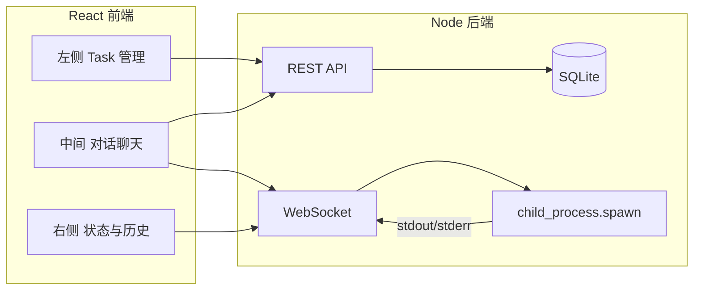

# 多 Agent 协作平台实现计划

## 1. 技术栈与整体架构

- **后端**: Node.js + Express（REST API）+ WebSocket（实时 agent 输出流）
- **前端**: React + 状态管理（React state/Context 或 Zustand）
- **持久化**: SQLite（better-sqlite3 或 sql.js），存储任务、聊天记录、agent 配置
- **Agent 调用**: `child_process.spawn` 执行配置的 CLI 命令，通过 WebSocket 将 stdout/stderr 流式推送到前端




---

## 2. 后端设计

### 2.1 项目结构（建议）

```
co_agent/
├── package.json
├── server/
│   ├── index.js           # 入口：Express + HTTP + WebSocket 挂载
│   ├── db.js              # SQLite 初始化与封装
│   ├── routes/
│   │   ├── tasks.js       # 任务 CRUD
│   │   ├── agents.js      # Agent 配置 CRUD（最多 5 个）
│   │   └── chats.js       # 按 agent 的聊天记录拉取/保存
│   ├── services/
│   │   └── agentRunner.js # spawn CLI、绑定 stdout/stderr、限流（同时只跑 N 个）
│   └── websocket.js       # WS 协议：发起 run、取消、流式输出
├── client/                 # React 前端（Vite 或 CRA）
│   └── ...
└── data/
    └── app.db             # SQLite 文件（可 .gitignore）
```

### 2.2 数据模型（SQLite）

- **agents**: id, name, cli_command（如 `node agent.js` 或 `python -u agent.py`）, cli_cwd（可选）, max_count=5 的约束在应用层校验
- **tasks**: id, title, description, status（pending/doing/done）, created_at 等
- **chat_messages**: id, agent_id, role（user/assistant）, content, created_at；可选 task_id 关联

### 2.3 Agent 调用方式（spawn CLI）

- 在 **agentRunner** 中：根据 `agents.cli_command` 解析出 command + args，在可选 `cli_cwd` 下 `spawn(command, args, { stdio: ['pipe','pipe','pipe'], cwd })`。
- 将 stdout/stderr 按行或按 chunk 读取，通过 WebSocket 推送到对应客户端（消息格式如 `{ type: 'output', stream: 'stdout'|'stderr', data }`）。
- 支持「当前会话」与「结束进程」：每个 agent 同一时间只允许一个 run 实例（或按需限制），提供 cancel 接口（kill 子进程）。
- 若需把用户输入传给 CLI：通过 stdin.write 写入子进程 stdin。

### 2.4 REST API 概要

- **Tasks**: `GET/POST /api/tasks`，`GET/PATCH/DELETE /api/tasks/:id`
- **Agents**: `GET/POST /api/agents`，`GET/PATCH/DELETE /api/agents/:id`（POST 时校验总数 ≤5）
- **Chats**: `GET /api/agents/:id/messages`（分页），`POST /api/agents/:id/messages`（仅保存 user 消息；assistant 消息可在流式结束时由后端写入）

### 2.5 WebSocket 协议（示例）

- 客户端发送：`{ action: 'start', agentId }` / `{ action: 'send', agentId, text }` / `{ action: 'stop', agentId }`
- 服务端推送：`{ type: 'output', stream, data }`、`{ type: 'exit', code }`、`{ type: 'error', message }`

---

## 3. 前端设计（React）

### 3.1 布局

- 三栏布局：左侧约 280px（任务列表 + 新建/编辑），中间 flex:1（当前 agent 的聊天 + 输入框），右侧约 320px（当前 agent 状态：运行中/空闲 + 历史会话列表或快捷入口）。
- 使用 CSS Grid 或 Flex：`display: grid; grid-template-columns: 280px 1fr 320px;`，并做简单响应（小屏可折叠侧边栏）。

### 3.2 主要页面/组件

- **左侧**  
  - 任务列表（来自 `GET /api/tasks`），支持新建、编辑、删除、状态切换。  
  - 可选：任务与「当前对话」的关联（如选择某任务后，发送消息时带上 task_id）。
- **中间**  
  - 顶部：当前选中的 Agent 名称（下拉可切换最多 5 个 agent）。  
  - 中部：消息列表（当前 agent 的 chat_messages），区分 user/assistant，流式输出时追加 content。  
  - 底部：输入框 + 发送按钮；若 agent 正在运行，可提供「停止」按钮（对应 WS `stop`）。  
  - 连接 WebSocket 后，收到 `start` 确认和 `output` 即更新当前会话的 assistant 消息（内存 + 可选持久化）。
- **右侧**  
  - Agent 状态：显示当前 agent 是否正在运行（由 WebSocket 或轮询 status 接口得知）。  
  - 聊天记录：可列出当前 agent 的历史会话或最近消息摘要，点击可切换会话（若实现多会话）或仅展示当前会话详情。

### 3.3 状态与请求

- 全局状态：当前选中的 agentId、当前任务 id（可选）、每个 agent 的「运行中」状态、当前会话消息列表。
- REST 用 fetch 或 axios；WebSocket 单例管理，按 agentId 区分 channel 或消息中的 agentId 字段。

---

## 4. 关键实现要点

- **最多 5 个 Agent**：在 `POST /api/agents` 和 `PATCH` 时校验 `SELECT COUNT(*) FROM agents`，≥5 时拒绝新增。
- **CLI 安全**：不直接把用户输入拼进 shell 字符串，而是用 `spawn(command, args[])` 传参，避免命令注入。
- **持久化聊天**：用户发送消息时 `POST /api/agents/:id/messages` 存 user 消息；assistant 消息在 agent 进程 exit 后由后端一次性或按 chunk 写入 DB，便于右侧「聊天记录」查询。
- **流式体验**：WebSocket 每收到一段 stdout/stderr 就在中间栏追加到当前 assistant 气泡，无需等进程结束。

---

## 5. 实施顺序建议

1. 初始化 Node 项目与 SQLite 表结构（agents, tasks, chat_messages）。
2. 实现 Agent 配置 CRUD 与「最多 5 个」校验。
3. 实现 agentRunner（spawn + stdout/stderr 流 + 单例/限流）。
4. 实现 WebSocket 服务端（start/send/stop + 推流）。
5. 实现任务 CRUD 与聊天消息 REST 接口。
6. 使用 Vite 创建 React 项目，实现三栏布局与占位内容。
7. 左侧：任务列表与表单对接 API。
8. 中间：Agent 选择、消息列表、输入框、WS 连接与流式展示。
9. 右侧：Agent 状态与聊天记录对接。
10. 联调、错误处理与简单样式优化。

---

## 6. 可选扩展（不纳入首版）

- 多会话 per agent（session_id），右侧展示会话列表。
- 任务与消息的强关联（按 task 筛选消息）。
- Agent 日志文件落盘（便于排查 spawn 问题）。
- 用户认证与多租户（当前可为单用户本地使用）。

若你希望首版尽量简单，持久化可先改为 JSON 文件（读写 `agents.json`、`tasks.json`、`chats.json`），后续再迁到 SQLite；架构不变，仅数据访问层不同。
