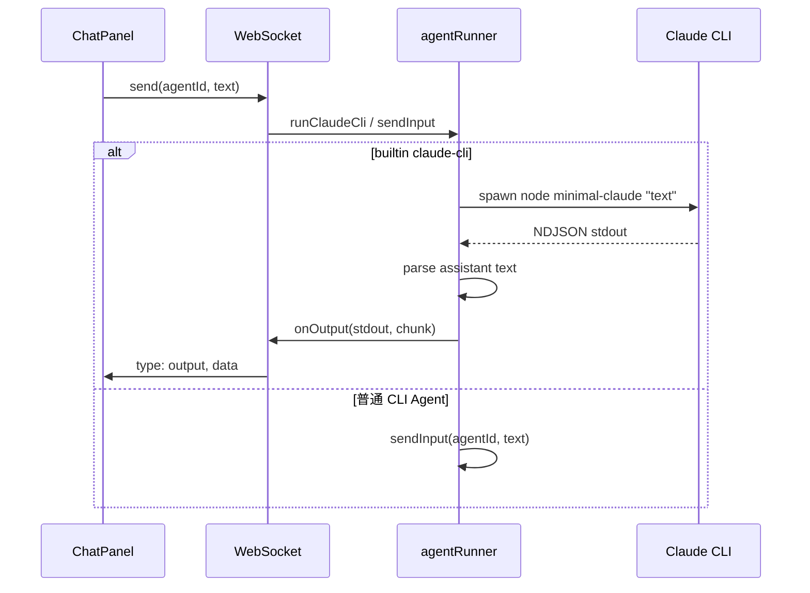

# 集成 claude-cli 内置 Agent 到多 Agent 协作平台

## 目标

- 优化 minimal-claude.js，抽成可被服务端调用的运行逻辑。
- 在平台中增加**内置 Agent**「claude-cli」：从 Agent 列表选择即可对话，回复以流式输出展示。
- 可选：聊天框内支持输入 `@claude-cli`（或 @ 选择 Agent）进行对话。

## 架构与数据流

## 1. 优化 minimal-claude.js（可复用模块）

- **导出运行函数**：新增并导出 `runClaudeCli(prompt, { onOutput, onExit })`，内部完成：
  - 按当前逻辑 spawn（Windows 下整条命令字符串 + 双引号转义，非 Windows 下数组参数）。
  - 使用 readline 消费 stdout，逐行 `JSON.parse`，仅对 `type === 'assistant'` 且 `message.content` 中 `type === 'text'` 的块调用 `onOutput('stdout', block.text)`。
  - 进程 `close` / `error` 时调用 `onExit(code, signal)` 或 `onExit(-1, err.message)`。
- **保留 CLI 入口**：当以 `node minimal-claude.js "..."` 运行时（可通过 `import.meta.url` 与 `process.argv[1]` 判断），调用 `runClaudeCli(process.argv[2], { onOutput: (_, data) => process.stdout.write(data), onExit: (code) => process.exit(code ?? 0) })`，保持现有命令行行为不变。
- **文件位置**：继续放在项目根目录，服务端通过相对路径引入（如 `server/services/agentRunner.js` 用 `import ... from '../../minimal-claude.js'`）。

## 2. 数据库与内置 Agent

- **agents 表**：增加可选列 `builtin_key TEXT`（如 `'claude-cli'`），用于标识内置 Agent；现有列保持不变。
- **迁移/初始化**：在 server/db.js 的 `db.exec` 中增加 `ALTER TABLE agents ADD COLUMN builtin_key TEXT` 的兼容处理（若列已存在则跳过），并在**应用启动时**若不存在 `builtin_key = 'claude-cli'` 的 Agent，则插入一条：`name = 'Claude CLI'`、`cli_command` 占位、`builtin_key = 'claude-cli'`。插入时需遵守「最多 5 个 Agent」的校验。
- **约束**：内置 Agent 在列表与聊天中与普通 Agent 一致（同表、同 API），仅运行逻辑不同。

## 3. agentRunner 支持 claude-cli

- **逻辑分支**：run() 没有 prompt 参数，prompt 由 WebSocket `send(agentId, text)` 带过来。
- **流程约定**：
  - **通用 Agent**：`start` 时 spawn 进程并登记到 `runs`，`send` 时对已存在进程 `sendInput(agentId, text)`。
  - **claude-cli**：每次用户发一条消息即一次「一问一答」：不在 `start` 时 spawn；在 WebSocket 收到 `action === 'send'` 且该 agent 为 `builtin_key === 'claude-cli'` 时，调用 `runClaudeCli(text, { onOutput, onExit })`，并登记到 `runs`，进程结束后从 `runs` 移除。
- **实现方式**：
  - 在 server/websocket.js 中，处理 `action === 'send'` 时先查 DB；若 `builtin_key === 'claude-cli'`，则调用 `agentRunner.runClaudeCli(agentId, text, onOutput, onExit)`，不再调用 `sendInput`。
  - 对 claude-cli，`action === 'start'` 仍返回 `{ type: 'started', agentId }`，不 spawn；真正 spawn 在 `send` 时进行。
- **stop**：通过 `runs` 中保存的 child 引用 `kill()`，与现有 `stop(agentId)` 一致。

## 4. 前端：流式展示与 @ 提及（可选）

- **流式**：后端对 claude-cli 仍发送 `type: 'output', stream: 'stdout', data`，前端现有 streamingContent 与消息列表即可流式展示。
- **@ 提及**（可选）：输入框检测 `@` 时展示 Agent 列表；若不做，用户通过选择「Claude CLI」再发消息即视为对话。

## 5. 实施顺序建议

1. minimal-claude.js：抽出 `runClaudeCli` 并保留 CLI 入口。
2. db：agents 表增加 `builtin_key`；启动时 seed「Claude CLI」。
3. agentRunner：新增 `runClaudeCli(agentId, prompt, onOutput, onExit)`，管理 `runs` 与 `stop`。
4. websocket：`send` 时 claude-cli 走 `runClaudeCli`；`start` 对 claude-cli 仅返回 started。
5. 前端：确认流式展示；可选 @ UI。

## 6. 关键文件与改动摘要

| 文件 | 改动 |
|------|------|
| minimal-claude.js | 导出 `runClaudeCli(prompt, { onOutput, onExit })`；保留 CLI 入口判断。 |
| server/db.js | agents 表增加 `builtin_key`；启动时 seed builtin_key='claude-cli'。 |
| server/services/agentRunner.js | 新增 `runClaudeCli(agentId, prompt, onOutput, onExit)`，管理 `runs` 与 `stop`。 |
| server/websocket.js | `send` 时若 builtin_key 为 'claude-cli' 则调 `runClaudeCli`；`start` 对 claude-cli 仅返回 started。 |
| 前端 ChatPanel / App | 可选：输入框 @ 触发 Agent 选择。 |

## 7. 边界与注意事项

- **并发**：同一时刻每个 agentId 仍只允许一个 run（含 claude-cli）。
- **cli_command**：内置 Agent 的 `cli_command` 仅占位；实际调用由 `runClaudeCli` 写死。
- **依赖**：服务端 ESM 可解析根目录的 minimal-claude.js（如 `import ... from '../../minimal-claude.js'`）。
